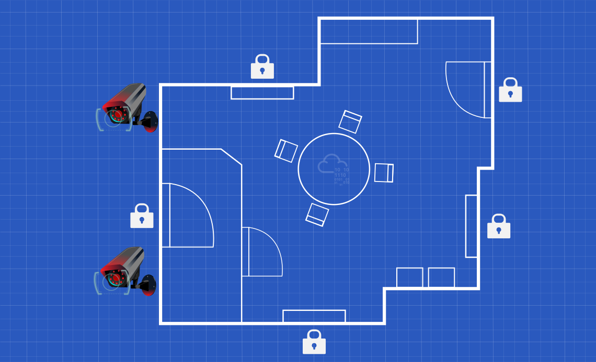

# Security Principles - TryHackMe Writeup

## This room introduced the security triad and common security models and principles.

---

## Objectives

Throughout this room, I learned how to:
- Explain the security functions: Confidentiality, Integrity and Availability (CIA).
- Present the opposite of the security triad, CIA: Disclosure, Alteration, and Destruction/Denial (DAD).
- Introduce the fundamental concepts of security models, such as the Bell-LaPadula model.
- Explain security principles such as Defence-in-Depth, Zero Trust, and Trust but Verify.
- Introduce ISO/IEC 19249.
- Explain the difference between Vulnerability, Threat, and Risk.

---

## Concepts Covered 

### CIA

- Learned what Nonrepudiation means
- Parkerian Hexad

Then, came a static lab, where the knowledge was put forth on a test. 5 questions, 1 minute. Situations were given, and had to be matched, based on the satisfied category of the CIA triad. One Answer was right among 3. Solving all without fails resulted into revealing a flag.

---

### DAD 

- The security of a system is attacked through one of several means. It can be via the disclosure of secret data, alteration of data, or destruction of data.

---

### Fundamental Concepts of Security Models

In this task, we were introduced to three foundational security models:
- Bell-LaPadula Model - aims to achieve confidentiality. It was not designed to handle file-sharing.
- The Biba Integrity Model - aims to achieve integrity. It does not handle internal threats (insider threat).
- The Clark-Wilson Model

We covered only three security models. And, there are many additional security models. Examples include:
- Brewer and Nash model
- Goguen-Meseguer model
- Sutherland model
- Graham-Denning model
- Harrison-Ruzzo-Ullman model

NOTE: These Models were NOT EXPLAINED!

A short assessment followed, requiring the identification of the appropriate security model based on real-world scenarios. 4 questions, 1 minute. Situations were given, and had to be matched, based on the satisfied category of the security models. One Answer was right among 3. Solving all without fails resulted into revealing a flag.

---

### Defense-in-Depth

- Defence-in-Depth refers to creating a security system of multiple levels; hence it is also called Multi-Level Security.
- Defense-in-Depth increases the effort required for an attacker to successfully compromise a system by forcing them to bypass multiple layers of security.

---

### ISO/IEC 19249

- ISO/IEC 19249 introduces architectural and design principles intended to improve system security through concepts such as separation, layering, redundancy, and least privilege.

ISO/IEC 19249 lists five architectural principles:
- Domain Separation. Every set of related components is grouped as a single entity; components can be applications, data, or other resources, and is assigned different security attributes. Domain separation is included in the Goguen-Meseguer Model.

- Layering. This makes it possible to impose security policies and easily validate that the system is working as intended. Layering relates to Defence in Depth.

- Encapsulation.  The aim is to prevent invalid values for variables. 
- Redundancy. This principle ensures availability and integrity.
- Virtualization. It provides sandboxing capabilities that improve security boundaries, secure detonation, and observance of malicious programs.

ISO/IEC 19249 teaches five design principles:
- Least Privilege: Giving limited permissions to the users on what they can and cannot access.

- Attack Surface Minimisation: Reducing as much scopes of attacks as we can by disabling services/features we don't need.

- Centralized Parameter Validation: Parameter validation is a necessary step to ensure the correct system state. Considering the number of parameters a system handles, the validation of the parameters should be centralized within one library or system.

- Centralized General Security Services: We should aim to centralize all security services. However, that can also become a potential threat to creating a single point of failure.

- Preparing for Error and Exception Handling: Whenever we build a system, we should take into account that errors and exceptions do and will occur. The systems should be designed to fail safe. Moreover, we should be careful that error messages don’t leak information that we consider confidential.

### Zero Trust versus Trust but Verify

Two security principles:
- Trust but Verify: This principle teaches that we should always verify even when we trust an entity and its behaviour.
- Zero Trust: This principle treats trust as a vulnerability, and consequently, it caters to insider-related threats. After considering trust as a vulnerability, zero trust tries to eliminate it. It is teaching indirectly, “never trust, always verify.”

### Threat versus Risk

There are three terms that we need to take note of to avoid any confusion.

- Vulnerability: Vulnerable means susceptible to attack or damage. In information security, a vulnerability is a weakness.
- Threat: A threat is a potential danger associated with this weakness or vulnerability.
- Risk: The risk is concerned with the likelihood of a threat actor exploiting a vulnerability and the consequent impact on the business.

### Conclusion

This room covered various principles and concepts related to security. By now, we are familiar with CIA and DAD and other terms such as authenticity, repudiation, vulnerability, threat, and risk. We visited three security models and the ISO/IEC 19249. We have covered different security principles such as defence in depth, trust but verify, and zero trust.

## Personal Takeaway

Before this room, I viewed security primarily as preventing attacks. This room showed me that security is also about managing trust, risk, and system design principles before attacks even occur.